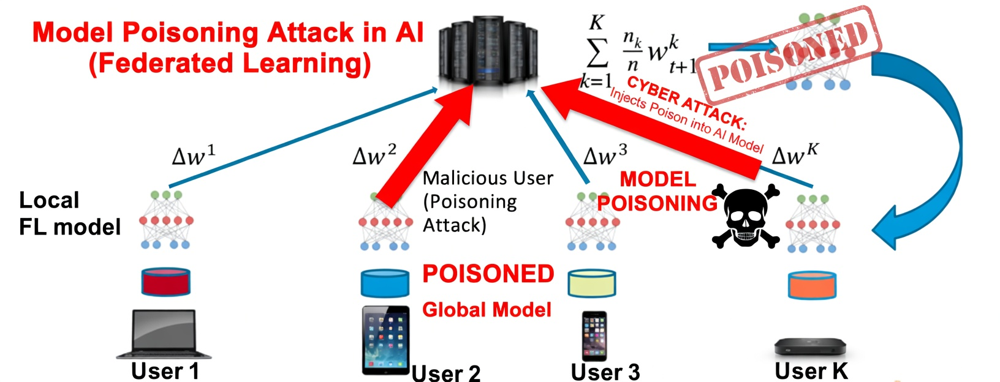
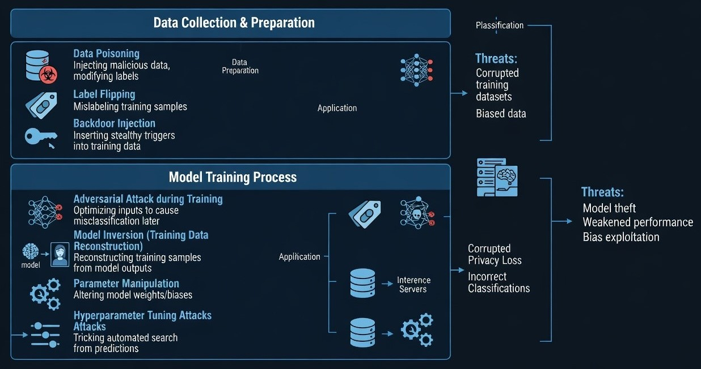
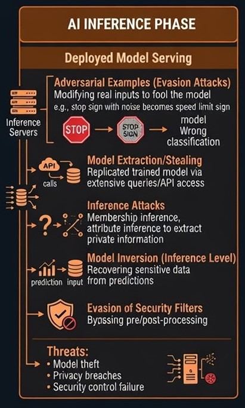
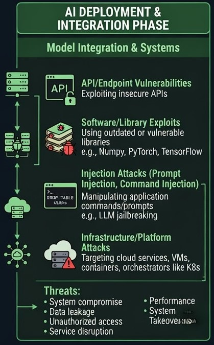

# Securing AI From Training to Production

A fully patched server. Network isolation done right. Access controls locked down. By every conventional measure, the system is secure. Yet it can still make systematically wrong decisions, over and over, without tripping a single intrusion detection rule. Reason: thing that was actually compromised is not the server. It is the model running on it.

That is the uncomfortable starting point for thinking about AI security. Machine learning systems are now approving credit, detecting fraud, steering autonomous vehicles, reading medical scans, and managing power grids. In every one of those cases, the model's integrity is a prerequisite for the reliability of everything downstream. Yet most organizations are still securing AI the same way they secure everything else: firewalls, patching, access control, code review. Those practices matter, but they were not built to catch a poisoned dataset, a backdoored checkpoint, or an adversarial input crafted to fool a specific model. This article walks through where AI systems are actually vulnerable, across training, inference, and deployment, and what a defense strategy that takes AI seriously actually looks like.

## Gap between Adopting AI and Securing AI

By 2025, roughly 72 percent of surveyed enterprises had embedded AI into at least one business function, up from 55 percent just two years earlier. That is a fast curve, and security architecture has not kept pace with it. In critical infrastructure specifically, energy, water, transportation, financial services, healthcare, AI adoption is accelerating under competitive and regulatory pressure that consistently rewards deployment speed over deployment caution.

Security researchers at MIT Lincoln Laboratory have a useful name for this: *the adoption security gap*. Conventional software security has decades of accumulated practice behind it, penetration testing, secure development lifecycles, code review, and none of it was designed with AI's failure modes in mind. A penetration test that probes network infrastructure and application APIs will not find a backdoor hidden in a neural network's parameter space. A secure development review that reads source code will not catch data poisoning buried in a training set. The gap is not theoretical. It is being actively exploited, and it exists because of three properties that make AI systems fundamentally different from the software that came before them.

**1. They are opaque.** A neural network's decision logic lives in distributed numerical weights, not readable code. A backdoor inserted into those weights can be functionally indistinguishable from normal model behavior and invisible to static analysis.

**2. They are persistent.** Whatever was trained into a model stays there, across every software patch and infrastructure update that does not involve retraining the model itself.

**3. They are interconnected.** Models trained for one purpose are routinely fine tuned and redeployed for another, and pretrained foundation models pulled from public repositories get embedded into downstream applications at scale. A compromise in one widely used foundation model propagates to every application that inherits its parameters.

## Localizing Vulnerability: Data, Algorithm, and Parameters

To understand AI specific risk, it helps to separate the three components an attacker can actually target: the training data that shapes what a model learns, the algorithmic architecture that structures that learning, and the numerical parameters that encode the result.

### Attacking the data

Three techniques target training data integrity, and they require nothing more than access to the data pipeline, not the model's code or infrastructure.

**Data poisoning** injects malicious examples directly into the training set. **Label flipping** mislabels existing samples: a genuinely fraudulent transaction gets labeled legitimate, malware gets labeled benign, a disease case gets labeled healthy. **Backdoor injection** goes a step further, pairing a specific trigger pattern with a target mislabel, so the model behaves normally on clean inputs and misfires only when the trigger appears. NIST's 2025 taxonomy of adversarial machine learning ranks data and model poisoning among the most consequential threat categories for both predictive and generative systems.

At the scale of large language model training sets, which routinely exceed a trillion tokens, even a fractionally tiny adversarial contribution translates into an enormous absolute number of poisoned examples.

Federated learning, where a model is trained collaboratively across many devices without any of them sharing raw data, adds its own version of this problem. Instead of poisoning a centralized dataset, a malicious participant poisons their local model update before it gets aggregated into the shared global model.

 

Figure 1: A malicious participant in a federated learning system can corrupt the shared global model by submitting a poisoned gradient update, without ever touching a centralized dataset or the other participants' data. 

 

### Attacking the architecture

Neural networks carry structural weaknesses that exist independent of the data they were trained on. Small perturbations in a specific direction push an input across a decision boundary. An attacker with access to a model's gradients, or who can approximate them through repeated queries, can construct inputs that fool the model with modifications a human would never notice.

### Attacking the parameters

The trained weights themselves are a third target. A parameter manipulation attack alters weights or biases directly, which can introduce targeted misclassification or a hidden backdoor activation channel without ever touching the training data or training code, and often without producing any observable change on standard test data.

## Threats Across the Lifecycle

### Phase one: Training

Training is the highest value target in the entire AI lifecycle, precisely because a compromise introduced here does not stay contained. It ships with the model, into every environment that model is deployed to, until someone retrains it from scratch.

Training infrastructure has its own version of model inversion, where an attacker with access to intermediate checkpoints reconstructs sensitive training data from the model's evolving parameters without ever touching the training set directly. Medical records, financial transactions, private communications: all of it can become partially recoverable from a model that was never supposed to expose it.

 

Figure 2: Corruption introduced during data collection or training does not stay isolated. It flows directly into the models that inference servers ultimately serve to production. 

 

### Phase two: Inference

Inference is where a model meets the outside world, and it is the most heavily studied phase in adversarial machine learning research for exactly that reason. Five attack categories dominate this surface.

**Adversarial examples** modify real inputs just enough to cause misclassification without the change being visually apparent, the classic example being a stop sign altered so subtly that a vision model reads it as a speed limit sign. **Model extraction** replicates a trained model through extensive API querying, letting an attacker build a functionally equivalent copy without ever touching the training data. **Inference attacks** use a model's own outputs to determine whether a specific individual's data was part of the training set. **Model inversion** goes further, recovering sensitive training data from predictions, with gradient inversion in federated learning representing the most severe version of this threat. **Evasion of security filters** targets the pre- and post-processing defenses wrapped around a model rather than the model itself.

No complete defense against adversarial examples exists today, but several mitigations meaningfully raise the cost of an attack. Adversarial training augments the training set with adversarial examples so the model learns to resist them. Input preprocessing, JPEG compression, bit depth reduction, spatial smoothing, disrupts the precise pixel level manipulation that many attacks depend on. Differential privacy training, output confidence calibration, and output restriction round out the primary defenses, each trading off some accuracy or latency for robustness.

 

Figure 3: Once a model is serving live predictions, it is exposed to anyone who can send it an input, which is what makes inference the most extensively studied attack surface in adversarial machine learning. 

 

### Phase three: deployment

Deployment blends conventional software risk with AI specific risk. Insecure API design, missing authentication, no rate limiting, verbose error messages, exposed model metadata, is the primary enabler of model extraction in the real world. none of it requires touching the model itself, just probing it enough times to reconstruct its behavior. The core numerical libraries AI systems depend on, NumPy, PyTorch, TensorFlow, carry their own vulnerabilities that can compromise the entire stack without anyone attacking the model at all. And the cloud services, containers, and orchestrators the model runs inside, Kubernetes among them, are conventional infrastructure targets that happen to sit underneath a very unconventional payload.

 The OWASP Top 10 for LLM Applications ranks prompt injection as the single highest severity vulnerability class in production LLM systems today. Command injection is the more familiar cousin: when a model's output gets translated directly into a system command or database query, an attacker can smuggle in operating system commands or SQL statements that execute with whatever privileges the AI application's runtime identity carries.

  

Figure 4: Deployment is where AI specific risk and conventional application security risk overlap, which means it needs both kinds of defenses at once. 

 

## Three Real-Time Deployment Cases 

**Autonomous vehicles** offer the most extensively documented evidence of physical adversarial attacks, mainly because a self driving car's perception system is exposed to anyone standing in its field of view, with no access control between attacker and model. Researchers at the University of Michigan, Carnegie Mellon, and Toyota Research Institute have demonstrated adversarial patches on stop signs that cause misclassification across multiple production grade vision architectures at realistic distances and speeds, lane marking attacks that push lane detection models into dangerous deviation outputs, and LiDAR spoofing that produces phantom object detections or suppresses real ones from up to 80 meters away. None of these have caused a real accident yet, but they demonstrate an attack class that conventional automotive cybersecurity simply has no controls for, because the input channel is a physical sensor, not a network port. Viable defenses include adversarial training of perception models, cross validating multiple sensor inputs against each other, anomaly detection for inputs that statistically deviate from the training distribution, and architectural redundancy so a single model's failure cannot produce a safety critical outcome on its own.

**Financial services** has run machine learning at scale for credit underwriting, fraud detection, and anti money laundering for well over a decade, and fraud is an organized, well resourced criminal enterprise with every incentive to understand and defeat the systems opposing it. Model extraction against fraud detection is a documented pattern: by submitting carefully chosen transactions to probe a model's decision boundary, an attacker can build a surrogate model that predicts which transaction patterns will get flagged, then design fraud campaigns specifically to slip under that boundary. Fraud research functions at major banks have published work specifically on detecting this kind of systematic probing before it produces a usable surrogate.

**Healthcare** is where adversarial vulnerability carries the most direct human cost. Research published in European Radiology in 2023 found that adversarial perturbations to chest CT images could flip a clinically deployed lung cancer detection model's output from malignant to benign with better than 95 percent success, and the perturbations required were smaller than the noise ordinary image compression already introduces, meaning they would survive a standard imaging pipeline undetected. A 2024 study from Stanford Medicine and Johns Hopkins extended the same finding to electrocardiogram interpretation, reliably causing misclassification of atrial fibrillation and acute myocardial infarction. Current FDA and CE regulatory pathways for AI as a medical device require performance validation on representative test sets, but not adversarial robustness testing, which means passing regulatory approval and being adversarially robust are currently two separate, unconnected achievements.

## Where the defenses fall short

 NIST's adversarial machine learning taxonomy catalogs more than 400 documented attack and mitigation techniques, and the sheer size of that catalog is itself evidence that no complete defense exists. Adversarial training improves resistance to the specific attack methods it was trained against, but offers no guaranteed protection against a novel variant. Differential privacy provides real formal guarantees against poisoning and membership inference, but the privacy accuracy tradeoff gets steeper the tighter those guarantees get. Detecting a supply chain compromise in a pretrained model's weights remains, in the general case, an unsolved problem: there is no widely deployed equivalent of code signing for model parameters, and the backdoor detection techniques that do exist can be defeated by more sophisticated insertion methods.

None of that is a reason to skip these defenses. It is a reason to treat AI security as continuous adversarial research and layered mitigation with known residual risk, not as a checklist that reaches a finished state.

---

*This article  draws on peer reviewed research and published case studies and is intended for general discussion, not as a substitute for a security assessment of any specific AI system.*
