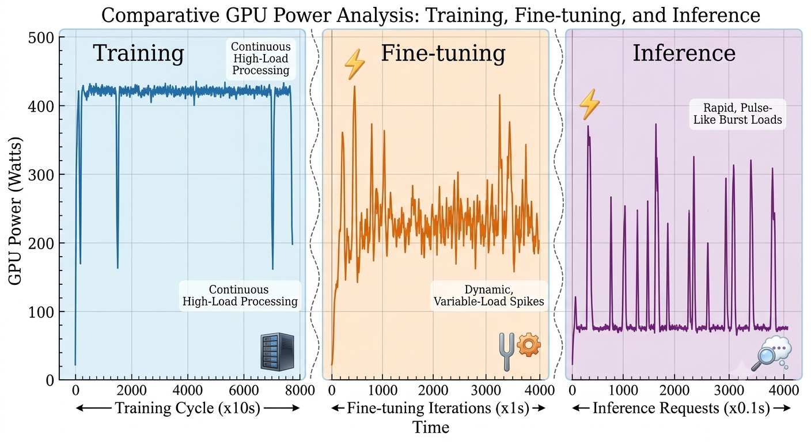
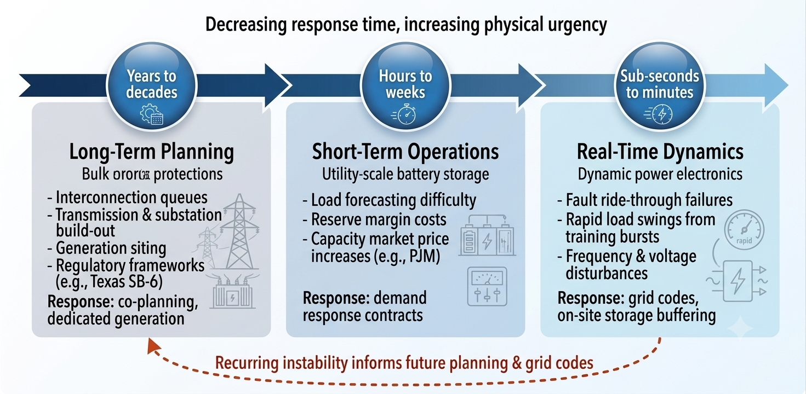

# Power Grid Impacts of AI Data Centers

Generative artificial intelligence (GenAI) has moved from a research cursoity to an industrial-scale consumer of electricity over the last two years. Training of frontend large language models typically draw tons to hudrends of GWh of electric energy in addtion to the around the clock operations of chatbots, coding assistants and corporate copilots at high power densities. These power levels were unimaginable in conventional data centers a decade ago. This article examines how that growth in AI data centers' energy requirements is straining the existing electric power grid infrastructure on account of stringent challenges posed by this recent interconnection of AI data centers and electric grid. This challenge is projected over three major timescales: multi-year long term planning, short term operations and real time monitoring. The bottom line is that power grid has now become a frontline constraint on largescale AI based productivity, deployment times and cost structures.  

## 1. AI Data Center Load

According to International Energy Agency (IEA) report, the global data centres consumed around 899 TWh of electricity in 2025 that accounts for 2% of total global energy consumption. These numbers are projected to rise to 6.7–12% by 2028. While traditional data centers run relatively stable, the AI data centers offer a high level of unstable and nonlinear response. AI data centers are built around dense clusters of graphics processing units (GPU) and tensor processing units (TPU), direct chip based or immersion liquid cooling and ultra-high-bandwidth synchronization infrastructure during training.

Four key features characterize AI data center load in terms of their impact on power grid:
1. **Power density:** A single AI-enabled rack can draw same electricty as an entire row of conventional servers.
2. **Load variability:** During large scale model training, AI servers's drawn power levels undergo swing by hundreds of megawatts within seconds.
3. **Power Quality:** AI facilities connect to the grid through power electronic converters which can introduce harmonic distortion.
4. **Ride-through requirement:** If a fault occurs, data center's power systems must ride through transient voltage and frequency excursions.

Power flows from generation through transmission and interconnection into the AI data center campus, where power electronics, storage, cooling, and the compute clusters interact with the software layer above them. Load swings and disturbances can, in turn, propagate back out to the grid operator and nearby users.

<!--
Source - https://stackoverflow.com/a/14747656
Posted by Tieme, modified by community. See post 'Timeline' for change history
Retrieved 2026-07-14, License - CC BY-SA 4.0
-->

Figure 1: AI Data Center Interconnection to the Grid

Power flows from generation through transmission and interconnection into the AI data center campus, where power electronics, storage, cooling, and the compute clusters interact with the software layer above them. Load swings and disturbances can, in turn, propagate back out to the grid operator and nearby users.

## 2. Electricity Demand of AI Data Centers

Large-scale AI workloads, such as the training and inference of LLMs, computer vision systems, and other compute-intensive AI applications consume high power demand exceeding 100 MW. As a result, AI data center is emerging as prominent large electric load in the power grid, with distinct demand patterns. There are generally three major forces that make the power grid a critical consideration for any organization whose operations depend on large scale AI training and inference.

### 2.1 High Power Demand
Intensive AI workloads require power levels that are substantially more than the conventional data centers. A ChatGPT query is estimated to consume about 3 Wh of energy compared to 0.3 Wh consumed by Google search. AI computing racks can reach power densities of 30-100+ kW per rack. Such extreme power density places considerable strain on data center architecture, cooling systems, and power grids.

### 2.2 Fast and large variability:

There are normally three stages of an AI-based task: training, fine-tuning and inference. Across these phases, AI workloads can be highly variable and bursty, with power demand fluctuating sharply over very short timescales and remaining difficult to forecast. 
- **Training stage:** The training stage is the most electricity
intensive phase of AI development, particularly for LLMs. For example, training GPT-3 is estimated to have consumed 1.29 GWh of electricity. 
- **Fine-tuning stage:** Fine-tuning stage adapts an alrfeady pre-trained model to a customized task. This stage typically requires substantially less computation and electricity than training from scratch.
- **Inference stage:** Inference is the process of executing a
well-trained AI model to generate outputs in response to user
inputs. On a per-query basis, it is the least electricity-intensive
stage of the AI model lifecycle.

Figure 2: Patterns of AI computing load during training, fine-tuning, and inference stages

## 3. Three Timescales of Grid Impacts

The impacts of AI data center load is broadly divided among three phases depending on the planning horizons. Each orizon calls for a different response.

Figure 3: Three timescales of grid impact from AI

### 3.1 Long-Term Planning (Years)

Over a long-term horizon, the challenge faced by utilities and regulators is how to build new grid infrastructure to serve ever-expanding AI data centers. Large AI infrastructure developers employ two practical responses to meet this challenge.

- **Coordinated Planning:** Parallel installation of a working data center with exapnsion of transmission capacity and addition of new generation from the utility companies.
- **Co-location with Dedicated Generation:** Major companies like Amazon made agreement to source nuclear power directly from a Pennsylvania plant. Similarly, Google's partnership with Kairos Power to deploy small modular reactors adjacent to its facilities is an example of co-located AI data centers with dedicated generation. 

### 3.2 Short-Term Operations (Days/Weeks)

Over weekly grid operations, AI loads complicate the balance of electricity supply and demand. AI loads consisting of training and inference tasks make the process of load forecasting difficult. This forces operators to hold larger reserve margins at higher cost. An emerging solution is that operators contractually agree to curtail or shift AI workloads during periods of system stress in exchange for compensation. 

### 3.3 Real-Time Dynamics and Grid Stability (Seconds)

In the operational regime of grids bearing AI large load, the focus is primarily shifts to real-time dynamics of electricity consumption and physical stability. As shown in Figure 1, AI facilities connect through power electronic converters which are highly sensitive to brief voltage sags or frequency deviations. This creates inadequate fault ride-through problem in which the data center is disconnecred from the grid temporarily. Emerging mitigations include:
- **Firmware-level power ramping:** Enforce gradual power changes at the processing units to avoid sudden load swings.
- **Rack-level battery storage:** Use small on-site batteries to absorb fast fluctuations to smooth out out the spikes and dips before they reach the grid. 

## 4. The Bottom Line

The AI revolution is an electrical revolution and the trafitional grid wasn't built for it. From multi-year planning horizons to millisecond stability constraints, the power system is now a decisive factor in how fast AI can scale, how much it costs, and where it can be deployed.

Solving this means rethinking everything: how we plan transmission, how we operate wholesale markets, and how we design data centers themselves. But one thing is certain: the future of AI will be shaped as much by transformers on utility poles as by transformers in neural networks.