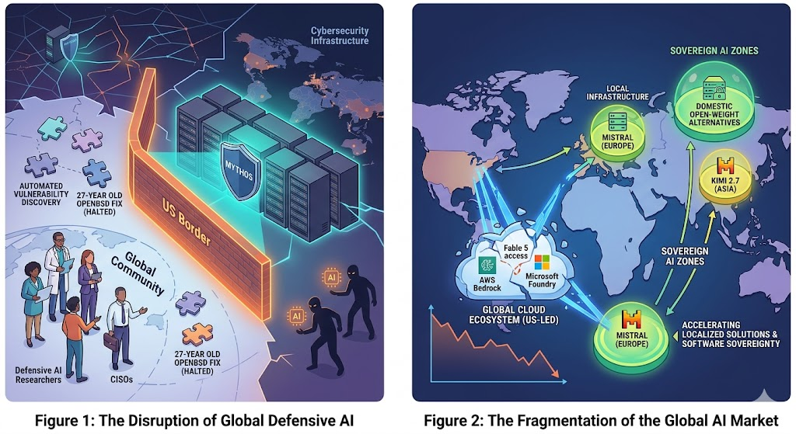
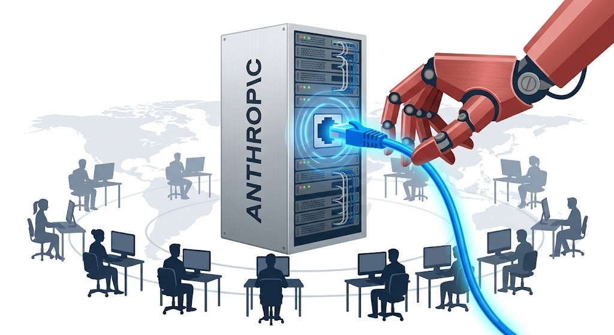

# New AI World Order

*“Dependence is a choice. Sovereignty requires investment."*

In the last week, the US government ordered Anthropic to stop the services of two of its most powerful models Fable 5 and Mythos 5 for non-US citizens, whether outsie or inside the US territory. This sent a shockwave to the global tech and security sectors who have been actively building applications and making exhaustive use of these powerful models since their launches. Due to the apparently daunting task of checking citizenship of every platform user, Anthropic chose to pull both models offline temporarily. 

At global scale, this amounts to the following implications that will be decisive in the next phase of this ongoing AI revolution.

## 1. Limited Defensive Shield in Cyber Security Sector

One of the major strengths of Mythos models is the automated discovery of any potential vulnerability and patching. By cutting off global access, the US has disarmed security players like CISCO of a tool for securing infrastructure from cyber threats.

On the other hand, malicious users will continue to exploit vulnerabilities by using alternative or open-source models (such as China's Kimi 2.7). Thus, restricting Fable and Mythos deprives the security sector of their best defensive shield. Earlier this year, the same model Mythos brought a major cybersecurity breakthrough when it discovered a 27 years old DoS vulnerability in OpenBSD operating system. 

## 2. Massive Disruption to Tech and Engineering Development

Fable 5 was a strong model specifically aimed at undertaking highly complex engineering and technology problems. Many tech companies had already integrated fable 5 into their development pipelines. After the disruption, the entire automation workflow was halted. 

There is also a growing realization at the global enterprise level that the dependecies on US-hosted cloud models leaves them vulnerable to suddent shutdown. This makes localized or open-source infrastructure far more attractive.

## 3. Shifting of AI Geopolitics

This ban by the US government has set a precedent of the authoritarian export controls over the access to software resources based on user nationality. It is on top of the already existing tight restrictions over Nvidia GPUs. 

The sudden lock down of a cloud based model has forced other nations to build or adapt alternative systems quickly. This leads to an accelerated global fragmentation. 

Some of the important reasons that should force regional powers to build their own LLMs are:
* **Sovereignty:** Control over AI implies control over national data, narratives and strategic capabilities. Dependency is a vulnerability.
* **Cultural alignment:** Models trained on local regional data are more efficient and adaptable towards serving citizens than imported AI.
* **Geopolitical Balance:** With multiple regional AI players, it is possible to prevent any single nation from using AI access as a blackmail option.
*  **Crisis Resilience:** In case of disruption of model access due to geopolitical tension, nations with domestic LLMs can sustain critical services semalessly. 

## 4. Path Forward

It should be acknowledged that the attainment of technological independence can be made possible by leveraging open-source solutions, Most of which originate from China (e.g., Llama, DeepSeek, Qwen). One does not have to build from scratch. 

For critical infrastructures and government departments, a sovereign AI is required to create legal and procurement frameworks. 

### Who is building what, right now

Several regional powers are actively working to build their own AI models or LLMs with the common aim of attaining AI sovereignty. 
* **European Union:** Under a s trong privacy-driven culture and EU AI Act based regulatory framework, EU is developing *Mistral* (France), *Aleph Alpha* (Germany) and *EuroLLM*. 
* **Middle East:** Gulf states are investing billions in sovereign AI as part of Vision 2030 to build *Jais* (UAE) and *Fanar* (Qatar)
* **South Korea/Japan:** Driven by strong semiconductor base and advanced robotics industry, this region is building models like *CLOVA X (Naver), HyperCLOVA X, KAITO*

## Conclusion

In the past one or two years, the frontier AI has ceased its role as a resource for public good. Now it has become a "controlled resource", especially, after the Anthropic directive. Samll regional powers now have to decide about their future by investing in localized solutions in order to escape from permanent technological dependence. 

