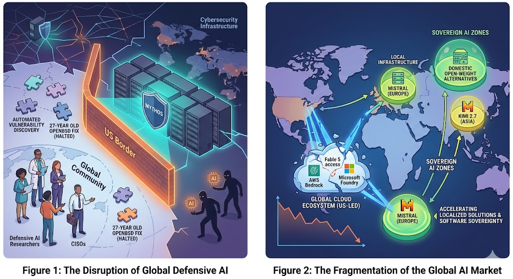
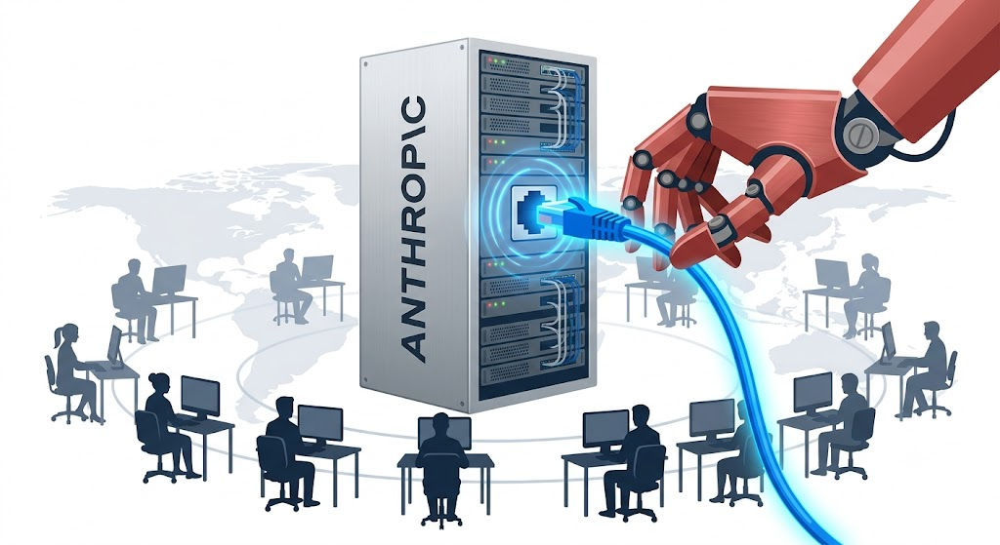

# New AI World Order

*"Dependence is a choice. Sovereignty requires investment."*

In the last month, the US government ordered Anthropic to stop the services of two of its most powerful models, Fable 5 and Mythos 5, for non US citizens, whether outside or inside US territory. This sent a shockwave through the global tech and security sectors, which have been actively building applications and making exhaustive use of these powerful models since their launch. Given the daunting task of checking the citizenship of every platform user, Anthropic chose to pull both models offline temporarily.

Although some limited features of Fable 5 have since been restored and made available to developers worldwide, this move from the world's leading AI power has served as a wake up call. On a global scale, it carries major implications that will be decisive in the next phase of the ongoing AI revolution.

## 1. A Weakened Defensive Shield in Cybersecurity

One of the major strengths of the Mythos models is automated vulnerability discovery and patching. By cutting off global access, the US has disarmed security players like Cisco of a tool for securing infrastructure against cyber threats.

Meanwhile, malicious actors will continue to exploit vulnerabilities using alternative or open source models, such as China's Kimi 2.7. This restriction on Fable and Mythos will deprive the security sector of one of its best defensive tools. Earlier this year, Mythos delivered a major cybersecurity breakthrough by discovering a 27 year old denial of service vulnerability in the OpenBSD operating system.

## 2. Massive Disruption to Tech and Engineering Development

Fable 5 was a strong model built specifically for tackling complex engineering and technology problems. Many tech companies had already integrated it into their development pipelines. After the disruption, entire automation workflows ground to a halt.

There is also a growing realization at the enterprise level that dependence on US hosted cloud models leaves organizations vulnerable to sudden shutdowns. This mistrust, driven by sudden policy shifts, is pushing companies to seek local models with strong reasoning capabilities, making localized or open source infrastructure far more attractive.

## 3. A Shift in AI Geopolitics

The restrictions imposed by the US government on access to its most powerful models set a precedent for export controls based on user nationality. This comes on top of already tight restrictions on the global reach of Nvidia GPUs.

The sudden lockdown of a cloud based model has forced other nations to build or adapt alternative systems quickly, accelerating global fragmentation.

Several key reasons are pushing regional powers to build their own LLMs:

* **Sovereignty:** Control over AI implies control over national data, narratives, and strategic capabilities. Dependency is a vulnerability.
* **Cultural alignment:** Models trained on local, regional data tend to serve citizens more effectively and adaptably than imported AI.
* **Geopolitical balance:** With multiple regional AI players, no single nation can use AI access as a bargaining chip.
* **Crisis resilience:** In the event of disrupted model access due to geopolitical tension, nations with domestic LLMs can sustain critical services without interruption.

## 4. The Path Forward

Technological independence can be achieved in part by leveraging open source solutions, many of which originate from China, including DeepSeek and Qwen. Nations do not need to build every model from scratch. Instead they can build upon the exisiting open source models to push for continual improvement in the LLM models. For critical infrastructure and government departments, sovereign AI requires clear legal and procurement frameworks.

### Who Is Building What, Right Now

Several regional powers are actively working to build their own AI models in pursuit of AI sovereignty.

* **European Union:** Under a strong privacy driven culture and the EU AI Act's regulatory framework, the EU is developing Mistral (France), Aleph Alpha (Germany), and EuroLLM.
* **Middle East:** Gulf states are investing billions in sovereign AI as part of Vision 2030, building Jais (UAE) and Fanar (Qatar).
* **South Korea and Japan:** Backed by a strong semiconductor base and an advanced robotics industry, this region is building models like CLOVA X (Naver), HyperCLOVA X, and KAITO.

## Conclusion

Over the past year or two, frontier AI has ceased to function as a resource for the public good. It has instead become a controlled resource, especially in the wake of Anthropic's directive. Small and mid sized powers now face a choice: invest in localized solutions or risk permanent technological dependence.
