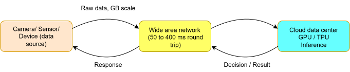
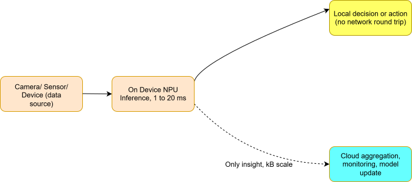

# Cloud AI vs. Edge AI: Where Should Your Inference Actually Live?

An intriguing question that remains hidden in a typical AI infrastructure is: once a model is trained, where does it actually run? For years the answer was assumed rather than debated. You shipped data to the cloud, a server somewhere did the thinking, and a result came back. That default is now cracking under its own weight.

By 2025, the International Data Corporation estimated that more than 75 billion connected devices were generating data at the network's edge: industrial sensors, autonomous vehicles, surgical robots, drone fleets, wearables. A growing share of the decisions these devices need are time sensitive in ways that a round trip to a data center simply cannot accommodate. That tension between **centralized convenience** and **physical reality** is what this article is about. 

## The short version

Cloud AI is not going away, and edge AI is not a replacement for it. Training large models, running batch analytics, and serving applications that can tolerate a few hundred milliseconds of delay: that is still cloud territory, and it will stay that way. But for a fast growing category of applications, autonomous industrial systems, real time cybersecurity response, connected vehicle decisions, private healthcare diagnostics, the cloud is not just suboptimal, it is structurally unable to meet the requirement. Edge AI is what fills that gap. Knowing where the line falls is becoming a genuine executive skill, not just an engineering preference.

## Defining terms: inference, not training

It helps to separate two things that get lumped together under "AI": training and inference.

Training is the expensive, iterative process of teaching a neural network by exposing it to large labeled datasets and adjusting its internal parameters. Training is almost always a cloud job, and nothing in this article argues otherwise. GPU clusters are expensive to own and easy to rent, and cloud providers concentrate that hardware so any team can access it on demand.

Inference is different. It is the act of taking an already trained model and applying it to new, live data to produce a decision, classification, or prediction. Cloud AI means that inference step happens on remote servers, typically operated by hyperscale providers such as AWS, Azure, or Google Cloud, or inside a company's own centralized data center. Data collected by a camera, sensor, or device travels over a network, gets processed remotely, and a response travels back. That round trip, whether it takes 50 milliseconds or several hundred, is the defining trait of the model.

Edge AI keeps that same trained model but runs it locally, on or near the device that produced the data. No round trip. That single architectural shift is the entire story of this article.

## Why the cloud only model is running out of road

For the first decade of commercial AI, cloud only inference was perfectly fine. Recommendation engines, fraud detection on batch transaction logs, customer service chat systems: none of these cared whether a response took 50 milliseconds or 400. Cloud AI thrived because it pooled scarce compute, let data scientists work from unified datasets, and made rapid iteration painless.

Four pressures have since converged to expose the limits of that model.

**Latency is a physical constant, not a bug to fix.** Light through fiber optic cable travels at a fixed speed, and no software update changes that. A collision avoidance system in a self driving car cannot absorb 200 milliseconds of network delay: at motorway speeds, that gap translates to roughly five meters of uncontrolled travel. A cybersecurity system trying to contain a ransomware encryption event needs to act in under a second, and ideally under 100 milliseconds, to stop lateral spread before it becomes unrecoverable. A surgical robotics platform tracking instrument position at sub millimeter precision cannot tolerate the jitter that wide area networks routinely introduce.

**Bandwidth economics do not scale.** Streaming raw high definition video from thousands of factory cameras, or continuous telemetry from a dense sensor array, to a central facility is expensive and, in many industrial settings, simply not possible over the available WAN connection. The ratio of raw data to useful signal is often enormous: a gigabyte of video might reduce to a few kilobytes of structured events once processed.

**Regulation is tightening the leash on data movement.** The EU AI Act entered full application in 2025, and similar frameworks are advancing across the UK, India, Brazil, and Southeast Asia, layered on top of existing regimes like GDPR and healthcare privacy law. Every byte of sensitive data sent to a third party cloud provider is, legally speaking, a data transfer that carries compliance weight. That weight is only increasing.

**Connectivity is not guaranteed.** Cloud AI assumes an always on network. Offshore energy platforms, underground mines, aircraft, remote agricultural equipment: these environments experience frequent or extended disconnection. Roughly 40 percent of the world's land surface still lacks reliable mobile broadband, and a meaningful share of high value industrial activity happens exactly there. A cloud dependent AI system in these settings is not resilient. It is periodically switched off by geography.

*Figure 1: In a cloud AI setup, raw data leaves the device, travels the network twice, and only then produces a usable result. Every stage adds latency, cost, and a compliance question.*

None of this means cloud AI is broken for the things it was built for. It means a specific class of application has outgrown it.

## How edge AI closes the gap

Edge AI keeps training in the cloud, where it belongs, but moves the inference step onto or near the device generating the data. The mechanism is straightforward once you see it: eliminate network transit from the critical path, and every problem tied to network transit disappears with it.

A model is trained centrally, then compressed and quantized before deployment. Quantization reduces a model's numerical precision, from 32 bit or 16 bit floating point down to 8 bit or even 4 bit integers, shrinking both memory footprint and compute requirements with little to no accuracy loss for most inference tasks. The compressed model then runs entirely on the edge device. Only the output, a label, an anomaly flag, a decision, travels upstream.

The hardware side of this has matured quickly. Dedicated neural processing units, purpose built chips for the matrix math behind neural network inference, now show up in industrial microcontrollers, smartphone chipsets, and edge servers from NVIDIA, Qualcomm, Intel, and a wave of specialist chipmakers. Google's [Edge TPU](https://www.coral.withgoogle.com/docs/edgetpu/faq/), built specifically for on device inference, delivers roughly four trillion operations per second on a two watt power budget, small enough to sit inside a factory sensor or a drone. Compute that once required a server room now fits on a circuit board.

*Figure 2: In an edge AI setup, inference happens on the device itself. The network is only involved for periodic, lightweight sync, not for every decision.*

There is a second layer worth knowing about: federated learning. Early edge deployments were purely inferential, models trained centrally, deployed once, updated occasionally over the air. Federated learning goes further by extending the learning step itself to the edge. Each device trains a local update using its own data, and only the mathematical gradient corrections, never the raw data, are sent to a central server for aggregation. The shared model improves from the collective experience of thousands of devices without any individual device's private data ever leaving its local environment. It is a genuine architectural innovation, not a workaround for a privacy problem.

Running inference across thousands of scattered devices is harder to manage than a single cloud deployment, and that is a fair criticism. Practitioners address it through what is often called MLOps at the edge, using platforms like Azure IoT Edge and AWS Greengrass to handle versioning, monitoring, and rollback across a fleet. The complexity is real engineering work, not a wall that blocks adoption.

### Cloud AI and edge AI at a glance

| Dimension | Cloud AI | Edge AI |
|---|---|---|
| Latency | 50 to 400 ms round trip | 1 to 20 ms, on device |
| Data sovereignty | Data leaves the premises | Data stays local |
| Bandwidth demand | High, continuous uplink | Minimal, insights only |
| Availability | Depends on WAN connectivity | Works fully offline |
| Unit economics | Scales centrally, per query cost | Higher upfront cost, low ongoing cost at scale |
| Model updates | Instant, centralized rollout | Needs scheduled or over the air sync |
| Best fit | Analytics, training, batch tasks | Real time, privacy critical operations |

## Three places this is already playing out

### Manufacturing lines that finally inspect everything

High volume production, semiconductor fabrication, automotive assembly, pharmaceutical packaging, runs at a pace where defect detection needs to keep up with hundreds or thousands of units per minute. Sending a high resolution image to a remote server, waiting for a verdict, and getting it back before the next unit arrives is a losing race against physics, not engineering.

Bosch has documented this transition across facilities in Germany, India, and China, installing compact edge inference nodes with industrial grade GPU and NPU hardware directly on production lines. Detection latency reportedly fell from hundreds of milliseconds under a cloud dependent setup to single digit milliseconds on premise, and the volume of data crossing the factory's WAN connections dropped by roughly 95 percent, since raw imagery is processed and discarded on site. Lines that once relied on statistical sampling, checking one unit in ten or fifty because full inspection was computationally infeasible, could move to inspecting every unit at full line speed.

The same logic applies to predictive maintenance. Turbines, compressors, and CNC machines generate continuous vibration and acoustic data that can flag mechanical wear hours or days before failure. Monitoring that stream centrally is expensive and slow; monitoring it locally, on the machine itself, lets an anomaly trigger a shutdown in milliseconds rather than after a costly delay. Siemens has reported downtime reductions in the 20 to 50 percent range after shifting from cloud based to edge based anomaly detection across its industrial IoT deployments.

### Cybersecurity that has to move at attack speed

Modern attackers do not wait for a human analyst to review a dashboard. Automated exploit tools and AI assisted malware can move from initial access to lateral movement within seconds. A defense architecture that ships network telemetry to a cloud SIEM, waits for centralized analysis, and pushes a response back through the network stack is, against that kind of adversary, already too slow.

Security research has generally converged on response latencies under one second, ideally under 100 milliseconds, as the threshold for meaningfully containing ransomware and advanced persistent threats. Darktrace, which deploys its self learning detection system as network appliances sitting directly inside the monitored environment, has published case data showing its autonomous response capability interrupting ransomware encryption events within seconds of the first suspicious file activity, entirely without a cloud consultation step. A five second round trip to the cloud, in the cases documented, would have been too slow to matter.

There is a regulatory dimension here too. Sending raw network telemetry to a cloud security platform means routing potentially sensitive metadata to a third party environment, which is often legally off limits for organizations under financial or healthcare regulation. Edge based security keeps that telemetry local and only shares distilled threat intelligence, which is likely why national bodies including the UK's National Cyber Security Centre and Germany's Federal Office for Information Security have published guidance favoring on premises or edge based AI security for critical infrastructure.

### Healthcare diagnostics without centralizing patient data

Medical imaging is one of the clearest wins for AI generally, with models matching or exceeding specialist accuracy on tasks like diabetic retinopathy detection and certain cancer screenings. The obstacle has always been structural: the imaging data needed to train and improve these models is among the most heavily protected data in existence, governed by HIPAA in the US and comparable rules elsewhere.

A research collaboration involving University College London, the University of Pennsylvania, and more than twenty international hospital systems, [documented through Penn's Center for Biomedical Image Computing and Analytics](https://www.med.upenn.edu/cbica/federated-learning-in-medicine-facilitating-multi-institutional-collaboration-without-sharing-patient-data.html), trained a brain tumor segmentation model across institutions using federated learning, without any patient scan ever leaving its home hospital. Each site trained a local update, and only encrypted gradient corrections were sent to a central aggregator. The resulting model reportedly outperformed any single institution's model, including the largest one, because it had effectively learned from a far more diverse set of scanners, protocols, and patient populations than any one hospital could offer alone.

## Where edge AI genuinely falls short

None of this is a free lunch, and a fair comparison has to say so plainly.

**Upfront cost is real.** Deploying inference capable hardware across a distributed fleet costs more upfront than a cloud consumption model, and building a credible return on investment case takes careful modeling of utilization, refresh cycles, and hardware lifespans, typically three to five years for edge compute nodes.

**Auditing gets harder.** Keeping consistent logs, monitoring, and explainability across thousands of distributed nodes is a bigger lift than centralized logging in the cloud, and the tooling for edge native observability is still catching up.

**Talent is scarce.** Running edge AI well requires a mix of embedded systems knowledge, MLOps discipline, network engineering, and hardware selection expertise that is harder to hire for than a typical cloud team, and that scarcity carries a price premium.

Edge AI is the right call for a growing set of critical applications. It is not, for most organizations, a wholesale replacement for cloud AI. A hybrid approach, assigning each workload to whichever tier actually fits its latency, privacy, and connectivity needs, is the practical answer for nearly everyone.

## The bottom line

Gartner's most recent edge computing forecast puts a number on how fast this is moving: [more than two thirds of enterprises globally are expected to deploy edge AI by 2029](https://zededa.com/gartner-predicts-2026/), up from roughly 10 percent in 2025. That is not a niche shift, it is a mainstream architectural transition happening on a compressed timeline.

Cloud AI and edge AI are not competitors fighting for the same job. They are two tiers built for different problems. Cloud AI is still the right place for training, batch analytics, and anything tolerant of network delay. Edge AI is structurally better suited to anything that needs to be fast, private, available offline, or economical on bandwidth, and the evidence from manufacturing floors, security operations centers, and hospital networks backs that up with measured outcomes, not just theory.

---

*This article draws on published research, publicly reported vendor case studies, and industry forecasts, and is intended for general discussion rather than as procurement or legal advice. Organizations should conduct their own due diligence before making architectural investments.*
