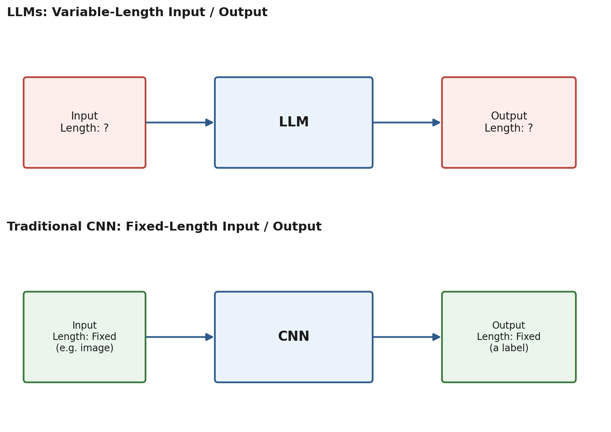
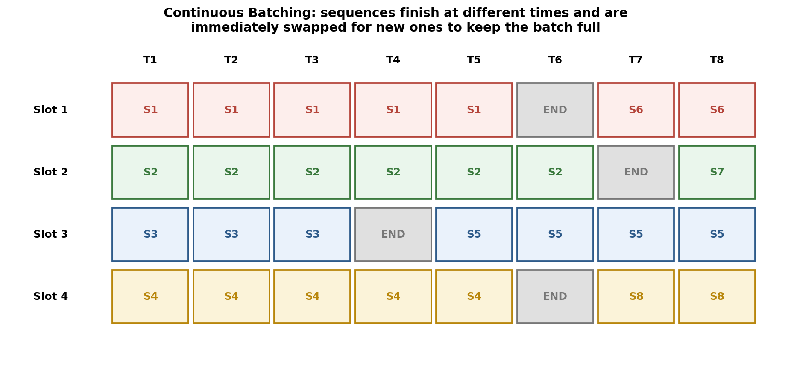
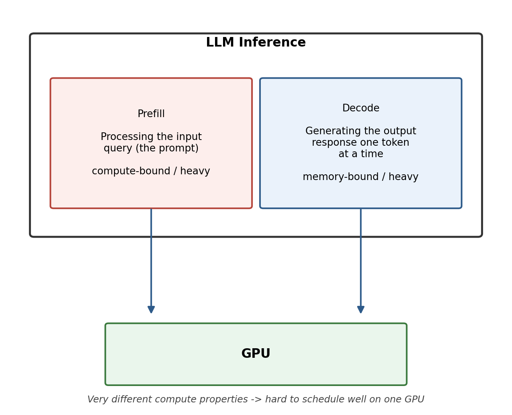
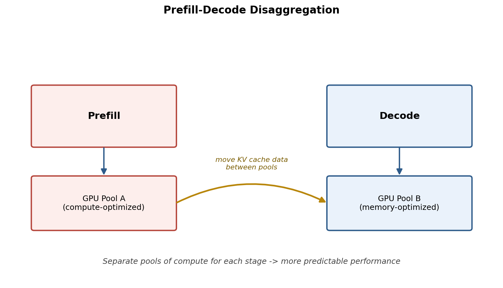
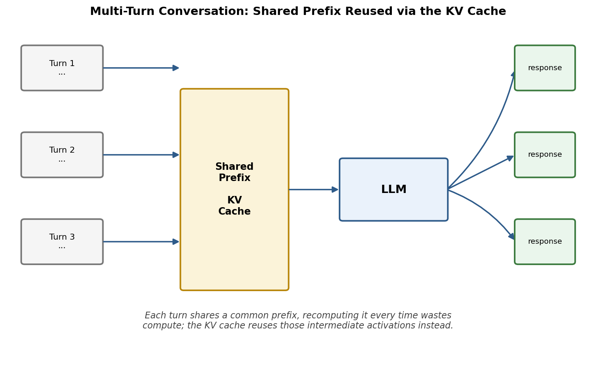
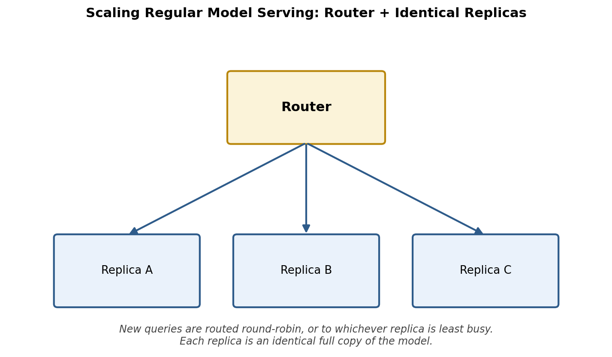
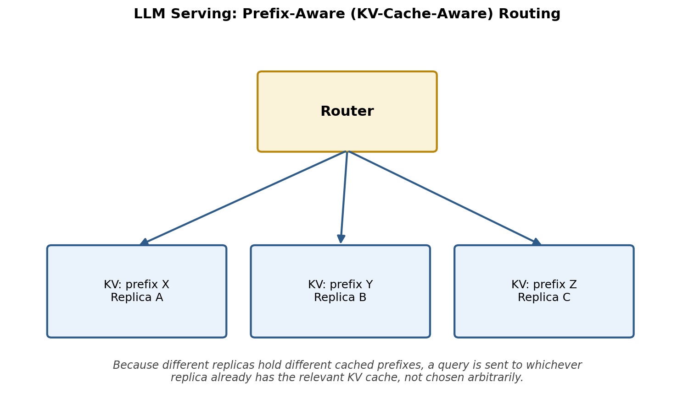
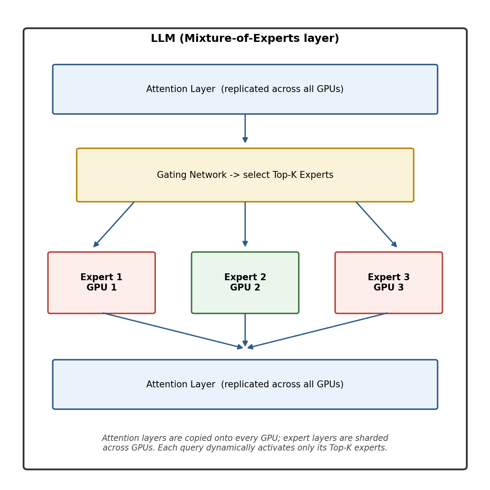

If you have spent any time around production machine learning systems, you have probably noticed a strange pattern. For years, serving a trained model in production was a relatively settled problem. You exported a model, wrapped it in a serving framework such as TensorFlow Serving or TorchServe, replicated it across a handful of GPUs, and put a load balancer in front. Done.

Then large language models arrived, and suddenly a whole new category of software showed up: vLLM, SGLang, TensorRT-LLM, and a growing list of similarly specialized "LLM inference engines." Why did the industry need a new class of tools instead of just reusing the serving stack that already worked well for years?

The honest answer is that LLMs behave fundamentally differently at inference time than the models that came before them, things like convolutional neural networks (CNNs) used for computer vision, or classic feed-forward classifiers. Those differences are not superficial. They touch how much compute a single request needs, how memory is consumed and reused, how requests should be batched together, how work should be scheduled across GPUs, and even how the model itself should be split across hardware. Once you understand these differences, the existence of purpose-built inference engines stops looking like industry hype and starts looking like an engineering necessity.

This article walks through those differences in order of increasing complexity: first the nature of the computation itself, then batching, then the two internal stages of LLM inference, then memory and caching, then routing across replicas, and finally model sharding strategies. Each concept builds on the one before it, and together they explain why "just running the model" is a much harder problem for an LLM than it ever was for a regular model.

## 1. Variable-Length Computation: The First Big Difference

The most basic distinction between LLMs and traditional models is the shape of their input and output.

A traditional CNN used for computer vision takes a fixed-size input, say a 224 by 224 pixel image, and performs a fixed and predictable amount of computation on it. The output is also fixed in shape: a probability distribution over a set number of class labels, or a small bounding box, or some other structured, bounded output. You know in advance, before you even run the model, exactly how much compute a single inference call will cost and how long the output will be.

An LLM does not offer that guarantee. The input can be a single sentence or fifty pages of text. The output, similarly, might be one word or several thousand tokens, and you generally do not know how long the response will be until the model has finished generating it, one token at a time. Both the length of the input and the length of the output are unknowns at the moment the request begins.

 

Figure 1: Fixed lenth input/output for CNN, while variable lenth input/output for LLMs. 

 

This single difference, variable versus fixed length, cascades into almost everything else discussed in this article. It changes how you batch requests together, how much memory you need to reserve per request, how predictable your latency is, and how you schedule work on the GPU. A serving system designed around the assumption of fixed-size, single-pass computation (like classic model servers) simply does not have the right abstractions to deal with a workload where every single request can vary wildly in both its input size and its output size, and where that output size is not even known ahead of time.

### 1.1 Why Variable-Length Computation Is Hard: The Need for Batching

To understand why this matters so much in practice, it helps to look at one of the most important techniques for getting good performance out of any kind of model inference: batching.

Batching means that instead of processing one request at a time, the system groups several requests together and processes them as one combined operation on the GPU. The reason this works is that the overhead of running a model is not linear in the number of inputs. It is not much more expensive, in wall-clock time, to process a batch of a few inputs together than it is to process a single input alone, because the GPU has enormous parallel compute capacity that a single small request often leaves mostly idle. Batching lets you use that spare capacity.

For traditional fixed-size models, batching is relatively simple: you gather a handful of same-sized inputs, stack them into a single tensor, run one forward pass, and split the outputs back apart. Every item in the batch takes exactly the same amount of computation, so the whole batch finishes at exactly the same time.

LLMs break this simplicity in two ways. First, the inputs in a batch can be different lengths, so you need padding or specialized attention kernels to handle that. Second, and more importantly, the outputs are generated token by token, and different requests in the same batch will finish generating at different times. One request might only need to produce five more tokens before it hits a stop condition, while its neighbor in the same batch might need five hundred more. If you batch requests together the naive way, borrowed from traditional model serving, you would either have to wait for the slowest request in the batch to finish before returning any results, or you would be forced to keep an already-finished request's slot idle until the whole batch completes. Either way, you waste GPU capacity and add unnecessary latency.

### 1.2 Continuous Batching: Keeping the GPU Full

The technique that LLM inference engines use to solve this problem is called continuous batching (sometimes also called in-flight batching). Instead of treating a batch as a fixed group of requests that all start and stop together, the serving system treats the batch as a fixed number of "slots," and continuously swaps requests in and out of those slots as they finish.

The diagram below illustrates the idea. Imagine a batch with four slots, tracked across eight steps of token generation. Sequence S1 occupies slot 1 for a few steps, then hits its end condition and finishes (marked END). Rather than leaving that slot empty, or waiting for the other three sequences in the batch to also finish, the system immediately swaps in a brand new sequence, S6, to fill the freed-up slot. The same thing happens independently in every other slot, at whatever time that slot's sequence happens to finish.

 

 Figure 2: Continuous batching grid showing sequences finishing at different times and being swapped for new ones 

 

This is one of the defining characteristics of LLM inference that has no real equivalent in regular model serving, because regular models never have this "each item finishes at a different time" problem in the first place. Continuous batching, together with the variable-length computation it exists to manage, is the first of several important properties of LLMs that are simply absent from traditional inference workloads, and it is a large part of the reason dedicated LLM serving engines exist at all.

## 2. Two Very Different Stages: Prefill and Decode

A second major property of LLM inference, independent of batching, is that generating a response with an LLM is not a single, uniform operation. It happens in two distinct stages that have very different computational characteristics.

The first stage is called prefill. This is where the model processes the entire input prompt in one pass, computing attention over every token in that prompt simultaneously. Because this involves large matrix multiplications over the whole prompt at once, prefill is compute-bound: the bottleneck is raw arithmetic throughput on the GPU.

The second stage is called decode. This is where the model generates the actual response, one new token at a time. On every single step, the model has to look back at everything it has generated and processed so far (using the cached keys and values from previous steps, discussed in the next section), but it is only producing one new token's worth of computation. This makes decode memory-bound: the GPU spends most of its time moving data (the cached activations) rather than doing large matrix multiplications, so the bottleneck is memory bandwidth rather than raw compute.

 

 Figure 3: Prefill and decode as two stages of LLM inference with very different compute properties, both running on the GPU. 

 

Traditional models have nothing like this. A CNN classifying an image does a single forward pass with one consistent computational profile from start to finish. An LLM, by contrast, alternates between a compute-heavy phase and a memory-heavy phase for every single request, and it does so continuously as decode steps repeat, one after another, until the response is complete.

### 2.1 Prefill-Decode Disaggregation

Because prefill and decode have such different resource demands, scheduling them on the very same GPU at the same time can cause them to interfere with each other. A long prefill for one request can delay the decode steps of other requests that are already in flight, leading to unpredictable, spiky latency. This matters a great deal in production, where consistent response times are often as important as raw throughput.

A common technique for addressing this is called prefill-decode disaggregation. Rather than running both stages on the same pool of GPUs, the system separates them onto two different pools of hardware, one optimized for the compute-bound prefill workload and another optimized for the memory-bound decode workload. When a request comes in, its prompt is processed on a prefill-optimized GPU, and the resulting cached data is then transferred over to a decode-optimized GPU, where the token-by-token generation actually happens.

 

 Figure 4: Prefill-decode disaggregation with separate GPU pools and data movement between them. 

 

This separation trades some added complexity (you now need to move data between two different pools of hardware) for much better predictability and, often, better overall utilization of both kinds of hardware resources. Again, this is a scheduling and resource-allocation problem that simply does not exist for regular models, because regular models do not have two internally distinct computational stages to begin with.

## 3. GPU Memory Management: The KV Cache

The third major area where LLM inference diverges sharply from regular inference is memory management, and specifically caching.

To avoid recomputing the same attention calculations from scratch at every decode step, LLMs keep around the intermediate key and value activations, computed during earlier steps, so they can be reused instead of recalculated. This is known as the KV cache (key-value cache). It is one of the most important and most resource-intensive parts of LLM serving.

The need for caching becomes especially clear in multi-turn conversations. Imagine a chat session where each new user message is, from the model's point of view, a fresh query, but one that shares a long common prefix with everything that came before it in the conversation. Recomputing that entire shared history from scratch on every single turn would be enormously wasteful. Instead, the system reuses the KV cache built up from the shared prefix, and only computes fresh activations for the new part of the conversation.

 

 Figure 5: Multi-turn conversation sharing a KV cache built from a common prefix, feeding into the LLM to produce separate responses. 

 

This introduces a whole new set of engineering questions that traditional inference systems never had to answer. Which activations should be kept in the cache versus recomputed, if memory runs out? How should the system manage that cache memory efficiently as many different requests, with different amounts of shared history, come and go? When should cached data be swapped out to slower storage rather than kept on the GPU?

One of the most influential answers to these questions came from vLLM, in a technique called PagedAttention. Borrowing an idea from operating systems, PagedAttention manages the KV cache in fixed-size, non-contiguous memory "pages," much like how virtual memory manages RAM in an operating system. This allows the system to avoid the memory fragmentation that comes from trying to allocate one large contiguous block of memory per request (which is wasteful, since you do not know in advance how long a given request's cache will need to be), and lets many requests share GPU memory far more efficiently than naive allocation would allow. Nothing comparable is needed for a regular model, since a regular model performs one self-contained pass and has no ongoing cache to manage across time steps or across requests at all.

## 4. GPU Management at Scale: Routing Strategies

Once you move beyond a single GPU and start scaling a service across many machines, another difference between LLMs and regular models emerges: how you route incoming requests.

For regular model serving, scaling typically means replicating the exact same model across multiple GPUs and putting a router in front. As new requests arrive, the router sends them to a replica using a simple strategy, such as round robin, or by checking a couple of replicas at random and sending the request to whichever one happens to be least busy at that moment. Because every replica is an identical, self-contained copy of the model with no shared state between requests, it genuinely does not matter which replica handles which request.

 

 Figure 6: Router distributing requests across identical replicas for regular model serving. 

 

LLM serving cannot get away with such a simple strategy, precisely because of the KV cache discussed above. If a given replica already has a user's conversation history cached from an earlier turn, sending that user's next message to a different, "cold" replica means throwing away all of that reusable cached computation and paying the full cost of recomputing it from scratch. Because there is so much potentially shared computation between different queries, LLM serving systems typically use prefix-aware (or KV-cache-aware) routing: the router keeps track of which replica holds which cached prefixes, and tries to send each new query to the replica that already has the relevant data cached.

 

 Figure 7: Prefix-aware routing sending each query to the replica that already holds the relevant cached prefix. 

 

This is a genuinely different routing problem from the one regular model serving has to solve, and it means the router itself has to be a much smarter, more stateful piece of infrastructure for LLMs than it typically needs to be for traditional models.

## 5. Model Sharding: Mixture-of-Experts Architectures

The final major difference covered here concerns how the model itself is split across multiple GPUs, which becomes especially important for large mixture-of-experts (MoE) models.

For a regular model, scaling across GPUs almost always means straightforward replication: you make several identical, complete copies of the model, each living entirely on its own GPU or set of GPUs, and route different requests to different copies as described above.

Many modern large language models use a mixture-of-experts architecture, however, and this changes the sharding picture substantially. In an MoE model, certain layers are not a single dense block of weights but rather a large collection of "expert" sub-networks, along with a gating network that dynamically decides, for each token, which small subset of experts (often called the top-k experts) should actually be activated. Attention layers, by contrast, are typically kept dense and are replicated identically across every GPU, much like in a regular model.

A common sharding strategy is to replicate the attention layers across all the GPUs, exactly as you would for a regular model, but to shard the expert layers, splitting the many different experts across the different GPUs, so that each GPU physically holds only a subset of the total experts. As a request is processed, tokens get routed dynamically to whichever GPU holds the experts that the gating network selected for them, which can differ from token to token and from layer to layer.

 

 Figure 8: Mixture-of-experts sharding with attention layers replicated across GPUs and expert layers sharded across GPUs, selected dynamically by a gating network. 

 

The result is that a large MoE-based LLM is not simply "ten identical model replicas," the way scaling a regular model would look. It behaves more like one large, distributed replica with a complex, dynamic internal routing system, where different parts of the model activate differently depending on the specific query being processed. Getting this right, so that GPU load stays balanced even as different experts get activated at different rates, is a genuinely harder scheduling and system-design problem than replicating a self-contained model ever was.

## Bringing It All Together: Why Specialized Inference Engines Exist

None of the five differences covered in this article are small implementation details. Each one, on its own, would be reason enough to rethink how a serving system is built:

- LLMs perform variable-length computation on both the input and the output side, unlike the fixed-size, fixed-cost computation of models like CNNs.
- That variability makes naive batching wasteful, which led to continuous batching, a scheduling technique with no real counterpart in regular model serving.
- LLM inference has two internally distinct stages, prefill and decode, with opposite compute characteristics, which regular models simply do not have.
- Those two stages benefit from being physically separated onto different pools of hardware, prefill-decode disaggregation, another idea with no analogue in traditional serving.
- LLMs rely heavily on a KV cache to avoid redundant computation across turns and across requests, creating memory management challenges (and solutions like PagedAttention) that fixed, stateless models never had to deal with.
- Scaling an LLM service requires prefix-aware routing so that requests land on replicas that already hold relevant cached data, rather than the simple round-robin or least-busy routing that works fine for stateless regular models.
- Mixture-of-experts architectures require sharding strategies that split expert layers across GPUs while keeping attention layers replicated, resulting in one large, dynamically-routed model rather than several independent replicas.

Put together, these differences explain why GPU management for LLMs is genuinely harder than it is for regular models, and why an entire category of specialized inference engines, vLLM, SGLang, TensorRT-LLM, and others, has emerged specifically to solve these problems. These tools exist not because engineers enjoy building new infrastructure for its own sake, but because the computational shape of LLM inference is fundamentally different from what came before it, and getting good performance and efficient scale out of these models requires techniques that were never necessary, and often were not even meaningful, for the model architectures that preceded them.

## Closing Thought

It is worth remembering that this is still a fast-moving area. New techniques for batching, caching, disaggregation, and routing continue to appear as researchers and engineers find new ways to squeeze more throughput and lower latency out of increasingly large models. But the underlying reasons these techniques are needed in the first place, variable-length computation, a two-stage inference process, heavy reliance on reusable cached state, and increasingly complex model architectures like mixture-of-experts, are likely to remain central to how LLM inference is understood for a long time to come. Anyone building or operating LLM-based systems benefits from understanding these fundamentals, since they explain not just what tools like vLLM and TensorRT-LLM do, but why they had to exist in the first place.
