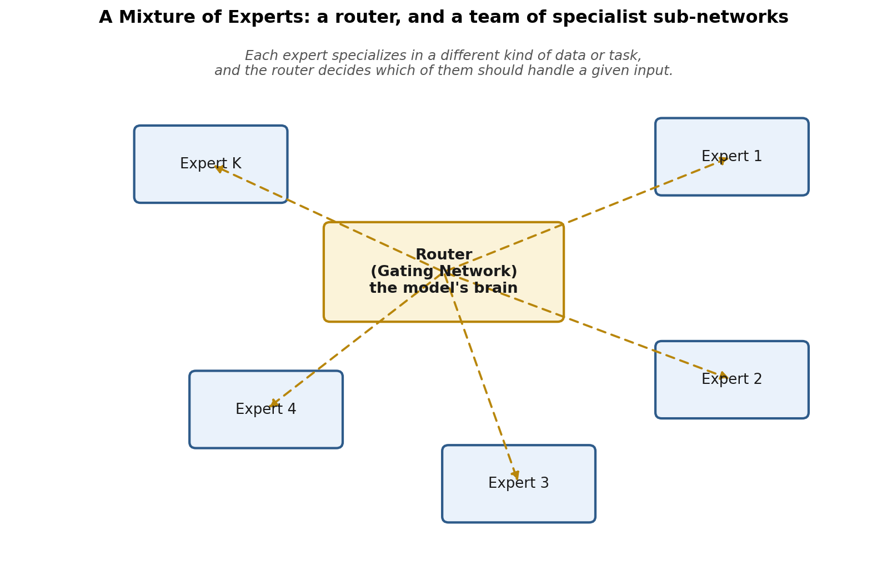
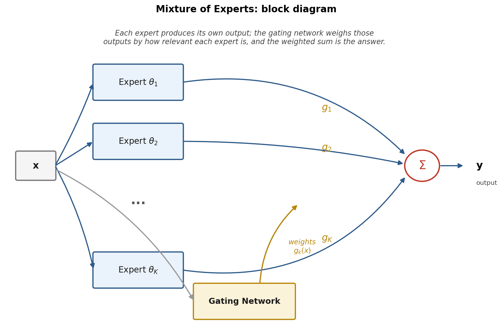
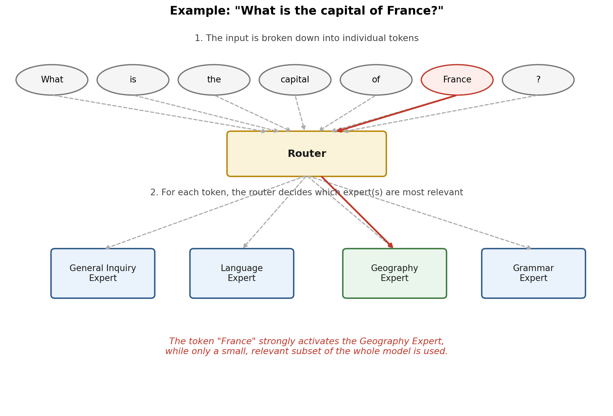
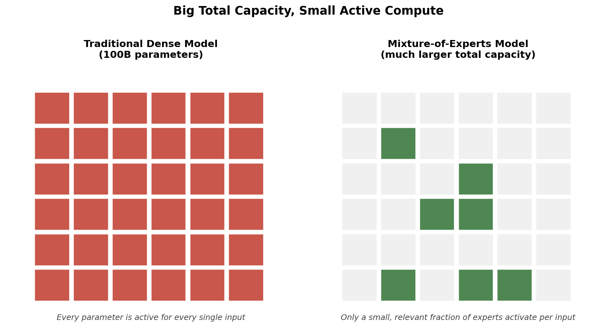

# Mixture of Experts: How AI Models Got Bigger, Faster, and Cheaper All at Once

How is it that today's AI models are not only more powerful, but more efficient, and more accessible than ever before? A few years ago, the assumption in machine learning was simple and a little grim: if you wanted a smarter model, you needed a bigger model, and a bigger model meant more GPUs, more electricity, and a much bigger bill. Scaling up was thus not possible without avoiding higher cost.

Yet today, smaller labs and startups are releasing models that rival systems built by the largest, best-funded AI companies like OpenAi and Anthropic, and they are doing it at a fraction of the compute cost. Companies like DeepSeek and Meta have used a particular architectural idea to compete with models from OpenAI and Anthropic without matching their raw spending. That idea has a name: Mixture of Experts, or MoE for short.

This article walks through what a Mixture of Experts model actually is, why it works, and why it has quietly become one of the most important architectural decisions in modern AI. We will build up the idea in stages: first the intuition, then the formal picture followed by a worked example, and finally the efficiency argument that explains why this architecture matters so much right now.

## The Secret Behind the Curve

If you have followed AI news over the past couple of years, you have likely seen headlines about DeepSeek's models matching or approaching the performance of far more expensive systems, seemingly overnight and on a much smaller budget. The explanation is not a single trick or a lucky training run. It is a structural choice about how the model itself is built.

That structural choice is Mixture of Experts, a breakthrough architecture that changes how a model uses its own parameters. Instead of a single dense network that applies every single one of its parameters to every single input, an MoE model is built from many smaller sub-networks, and it learns to use only the ones that are relevant to whatever it is currently processing. This single design decision is a large part of why some newer models can compete with much larger, more expensive competitors while spending far less compute per query.

## What Exactly Is a Mixture of Experts Model?

At a high level, a Mixture of Experts model is made up of many small neural networks called experts. Each expert is trained to handle different types of data or tasks, and rather than working in isolation, they work together as a team.

A useful way to picture this is to imagine a large hospital instead of a single, all-knowing doctor. A general practitioner cannot be the best in the world at cardiology, radiology, and orthopedics all at once, but a hospital can employ specialists in each of those areas and route each patient to whichever specialist (or combination of specialists) is right for their particular case. A Mixture of Experts model is built the same way. It has many specialists (the experts), and it needs a mechanism to decide who should see which patient.

That mechanism sits at the heart of the system, and it is called a gating network, or router. You can think of the router as the model's brain in miniature: its entire job is to look at an incoming piece of data and decide which expert, or combination of experts, is best suited to handle it.

 

Nothing about this arrangement is magical on its own. Committees of models, ensembles, and specialist sub-networks have existed in machine learning for a long time. What makes Mixture of Experts genuinely important for modern large language models is exactly how the router makes its decisions, and just as importantly, what that routing decision buys you in terms of computational cost. We will get to that shortly. First, let's put the intuition above into a more precise, formal picture.

## Formalizing the Idea: The Block Diagram

Underneath the specialist-hospital analogy is a fairly clean piece of mathematics. The core idea behind Mixture of Experts is combining several learning models together to form a better learner, and to boost overall performance by exploiting each one's individual characteristics, rather than forcing one network to be good at everything.

Here is the block diagram version of the architecture. An input, call it $\pmb{x}$, is passed to every expert in the model, each of which is a separate function parameterized by its own set of weights, written as $\pmb{\theta}_1, \pmb{\theta}_2$, all the way through $\pmb{\theta}_K$ for $K$ experts. Each expert produces its own output based on $\pmb{x}$. Those outputs are not simply averaged or summed together directly. Instead, each one is scaled by a weight before it is combined with the others.

 

Those scaling weights come from the gating network, and this is the detail that makes the whole system work. The output of each expert is weighted according to the outputs of the gating network, and critically, those weights are themselves functions of the input. In the diagram above, the gating functions are written as $g_k(\pmb{x})$ for $k$ running from $1$ to $K$, and each one controls how much importance a particular expert should have toward the model's final decision for that specific input.

This has an important consequence: the weighting is not fixed. It changes dynamically depending on what $\pmb{x}$ actually is. For one input, the gating network might put almost all of its weight on expert 3. For a completely different input, it might spread weight across experts 1, 4, and 7 instead. The final output, $y$, is simply the weighted sum of every expert's output, using those input-dependent gating weights.

Both halves of this system are learned together, not designed by hand. The weights $g_k(\pmb{x})$ are optimally tuned during the training phase, along with the full set of parameters $\pmb{\theta}_k$ for every expert $k$, so the gating network and the experts are trained jointly, learning simultaneously how to divide up the problem and how to solve each piece of it.

## Walking Through an Example: "What Is the Capital of France?"

The block diagram is precise, but it can still feel abstract without a concrete example, so let's trace through what actually happens when a Mixture of Experts language model processes a real question: "What is the capital of France?"

First, the model breaks down your input into individual tokens. Rather than treating the whole sentence as a single unit, it splits the sentence into smaller pieces, roughly: "What," "is," "the," "capital," "of," "France," and "?". Each of these tokens will be routed individually, not the sentence as a whole.

 

For each token, the model decides which expert or experts are more relevant to that specific piece of text. It does not send every token to every expert. Instead, it chooses one, or a small handful, for each token. In our example, when the router sees the token for "France," it might specifically trigger the expert associated with geography, since that expert has learned, over the course of training, to specialize in exactly this kind of content: place names, countries, and geographic relationships. Meanwhile, a token like "is" might instead lean on a more general-purpose or grammar-oriented expert, since it carries less specialized meaning on its own.

This is the point where the earlier analogy pays off. Just as a hospital does not send every patient to every department, an MoE model does not send every token through every expert. The router looks at each token and decides, case by case, which specialists in its team are worth consulting.

## Why Selective Activation Is the Key Insight

This selective activation is the key idea behind the entire architecture, and it is worth pausing on why it matters so much. Instead of using the entire model for every single input, a Mixture of Experts model only chooses parts of the model for each token it processes.

Think about what this means in practice. A traditional, dense neural network has no such option. If it has 100 billion parameters, then processing any input, however simple, activates something close to all 100 billion of those parameters. There is no mechanism for the network to say "this part of me is not relevant right now, so skip it." Every parameter gets used, every time, whether the input is a simple greeting or a complex multi-step reasoning problem.

A Mixture of Experts model breaks that constraint. By deciding, per token, which specific experts to activate, it avoids doing unnecessary work. Choosing specific experts to activate for each piece of input allows the system to save meaningfully on compute and processing time, without giving up the option of having a very large number of total parameters available across the whole model.

## The Real Payoff: Big Total Capacity, Small Active Compute

This brings us to the efficiency argument, which is really the heart of why Mixture of Experts has become such a big deal in the AI industry.

Each expert in an MoE model has its own weight parameters, just like any neural network would. Traditionally, bigger models with more parameters tend to perform better, but they also require far more computational resources, which makes them less accessible; fewer organizations can afford to train or even run them. This has historically been the central tradeoff in AI: more capability meant more cost, with no way around it.

Consider the comparison between a traditional dense model with, say, 100 billion parameters, and a Mixture of Experts model. With Mixture of Experts, the total number of model parameters can be enormous, potentially far larger than that dense 100-billion-parameter baseline, but only a fraction of those parameters are actually active at any given time.

 

Here is the important structural detail: all of the experts have their own number of parameters, and traditionally, each of those contributes to the total sum of parameters across the whole model. But for any given input, only a subset of these experts is actually used. That means the parameters belonging to whichever experts were selected are the only ones doing work for that particular piece of input. The rest of the model, all those other experts sitting idle for this particular token, contributes nothing to the computation and costs nothing in terms of processing time.

By reducing the number of parameters actually involved in any single computation, the overall process becomes far less computationally intense, even though the model's total size, and therefore its total learning capacity, can be vastly larger than a dense model's. In short, Mixture of Experts models have the learning capacity of much larger models, but they only use what they actually need for each individual input.

This is the mechanism that explains the headlines. A model built this way can have an enormous number of total parameters, giving it broad knowledge and capability across many domains, while keeping the actual compute cost of answering any single query much closer to that of a far smaller dense model. That combination, large total capacity paired with small active compute, is precisely what allows a company to build something competitive with a much larger rival's dense model, without needing to match that rival's compute budget.

## How Do the Experts Learn to Specialize?

A natural question at this point is: who tells each expert what to specialize in? The surprising answer is nobody does, at least not directly. Nobody hand-labels expert 1 as "the geography expert" and expert 4 as "the grammar expert." That kind of specialization is not programmed in; it emerges naturally from training.

Recall that the gating weights g_k(x) and the expert parameters theta_k are all learned together, using the same training process and the same loss function. Early in training, the router's preferences are close to random, and every expert sees a fairly mixed bag of tokens. But small, random differences in initialization mean that some experts will, purely by chance, end up doing slightly better on certain kinds of tokens than others. The router picks up on this: if expert 3 happens to handle geography-flavored tokens a little better than its peers, the gating network learns to route a few more geography tokens its way. Expert 3 then sees more geography examples during training, gets even better at that narrow slice of the problem, and the router's preference for sending it geography tokens strengthens further. This feedback loop, small early advantage, more relevant data, larger advantage, is what causes clean specialization to emerge over the course of training, without anyone explicitly assigning topics to experts.

Left completely unchecked, this feedback loop has an obvious failure mode: a handful of "popular" experts could end up absorbing most of the traffic, while other experts are rarely chosen and barely improve at all. This is usually called router collapse or load imbalance, and it defeats the entire point of the architecture, since an MoE model with nine idle experts and one overloaded one behaves a lot like a much smaller dense model, just with extra dead weight attached. To prevent this, MoE training typically adds a load-balancing term to the loss function, which nudges the router toward spreading tokens more evenly across the full set of experts, rather than letting a small clique of favorites dominate. Getting this balance right, enough specialization to be useful, but not so much concentration that most of the model goes unused, is one of the trickier practical challenges in training these systems well.

## Sparse Models in the Wild

Mixture of Experts is often described using the word "sparse," in contrast to a "dense" model. A dense model, the traditional kind, uses all of its parameters on every input, exactly as shown in the comparison figure above. A sparse model, like an MoE, has a large pool of parameters available in total, but only activates a small subset of them for any single input. This is why you will sometimes see MoE models described by two different parameter counts at once: a "total parameters" figure, which includes every expert whether or not it gets used often, and an "active parameters" figure, which reflects how many parameters actually do work on a typical token. The active parameter count is usually a much smaller number, and it is a far better predictor of how expensive the model actually is to run.

This distinction is not just academic. Several well-known language models released over the past couple of years, including Mistral's Mixtral models and DeepSeek's V-series, are openly built around Mixture of Experts, and both publish separate total and active parameter counts for exactly this reason. A model might report, for example, well over a hundred billion total parameters, while only activating a small fraction of that per token, similar in spirit to the 100-billion-parameter dense baseline used in our earlier comparison, but with dramatically more total knowledge stored across its full set of experts. That gap between total size and active size is the entire efficiency story of Mixture of Experts compressed into two numbers.

## Common Misconceptions Worth Clearing Up

Because Mixture of Experts is a relatively new idea to most people outside the AI research community, a few misunderstandings tend to come up repeatedly, and it is worth addressing them directly.

The first is assuming that each expert is a fully separate, standalone model, the way you might imagine ten completely different chatbots bolted together behind a switchboard. In practice, experts usually replace only a specific portion of the network, most commonly certain feed-forward layers, while other components, such as the attention layers responsible for understanding relationships between tokens, remain shared and fully active across the whole model. So an MoE model is less like ten independent models glued together, and more like one shared model that happens to have several interchangeable modules in specific spots.

The second misconception is thinking that only one expert is ever chosen per token. Many real systems use what is called top-k routing, where a small number of experts, commonly two, are activated together for each token, and their outputs are blended according to the gating weights discussed earlier, rather than picking a single winner and discarding the rest.

The third misconception is assuming that more experts automatically means a better model. Adding experts increases total capacity, but it also makes routing harder, increases the risk of load imbalance discussed above, and adds engineering complexity around how experts are distributed across hardware. The number of experts, and how many are activated per token, are themselves design choices that have to be tuned carefully, not a dial you can simply turn up for free.

## Why This Matters for the Industry

This is exactly why companies like DeepSeek and Meta have leaned so heavily on Mixture of Experts architectures. They are trying to compete with models from extremely well-resourced companies like OpenAI and Anthropic, and Mixture of Experts gives them a path to comparable capability at a fraction of the cost, both in training and in day-to-day inference.

It is worth being precise about what "a fraction of the cost" actually means here, because it is not marketing language, it is a direct consequence of the architecture described above. Every additional expert added to a Mixture of Experts model increases the model's total parameter count and, with it, its total learning capacity. But because only a handful of experts activate for any given token, that additional capacity does not translate into a proportional increase in the compute required to answer a typical query. You get to keep adding specialists to the hospital without needing to send every patient through every single department.

This is also why Mixture of Experts is not simply a cost-cutting trick bolted onto an existing model. It reflects a different philosophy about how intelligence should be organized inside a neural network: instead of one enormous, undifferentiated block of parameters that must be fully engaged for every task, you build a large, diverse team of smaller specialists and a smart router capable of figuring out, on the fly, exactly who should be consulted for the problem currently in front of it.

## Conclusion

Mixture of Experts answers the question we opened with. Today's AI models can be more powerful, more efficient, and more accessible all at the same time because they are no longer forced to choose between size and speed. By splitting a model into many smaller expert sub-networks, training a router to decide which experts matter for each token, and activating only that small relevant subset for any given input, a Mixture of Experts model gets to have it both ways: the learning capacity of a much larger dense model, and the operating cost of a much smaller one.

That is a meaningfully different way of building intelligence, and it explains a great deal about the current AI landscape, including why companies without the largest compute budgets in the world have managed to build models that can stand up to the giants. As this architecture continues to mature, expect the gap between "biggest model" and "most capable model" to keep growing more interesting, precisely because those two things no longer have to mean the same amount of compute.
